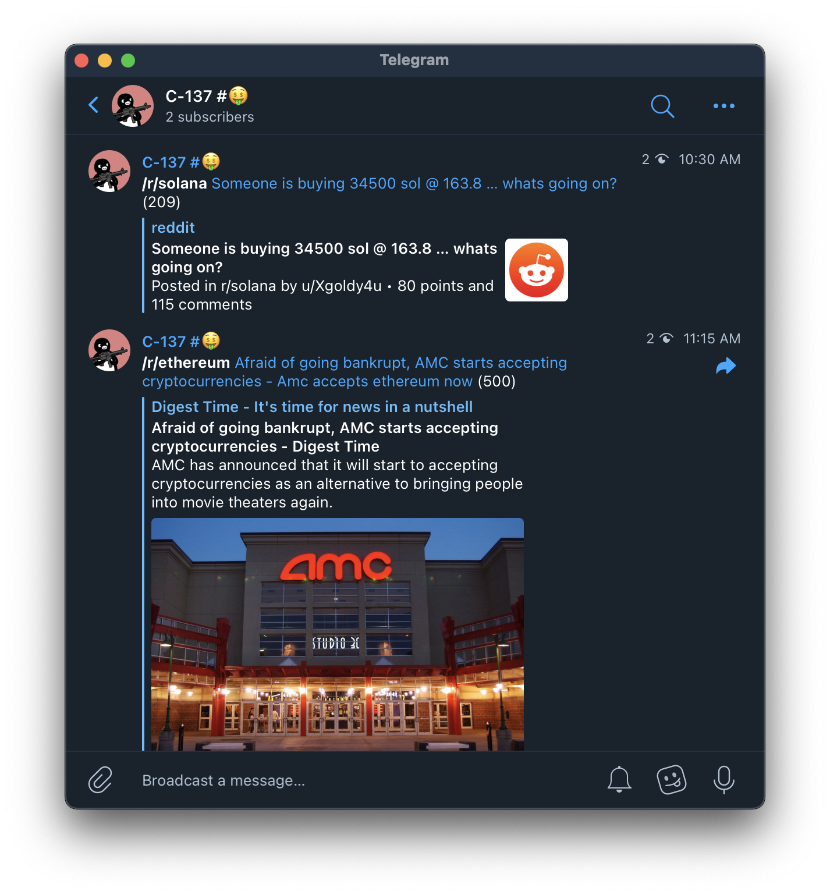

# tg-subreddit

Subreddit in your Telegram

## What's it?

`tg-subreddit` is a simple program for polling, filtering and posting subreddit updates to any Telegram chats.



## Configurations

`tg-subreddit` accepts following JSON configuration (`poll-settings.json`, [schema](./tg_subreddit/models.py)):

```javascript
{
    // poll_interval_in_seconds - polling interval for reddit posts polling action.
    // This settings controls how often will we execute the polling.
    // After each polling execution, this program sleeps for max(30s, poll_interval - polling_execute_duration)
    // to avoid throttling
    "poll_interval_in_seconds": 30,

    // subreddit_poll_interval_in_seconds - polling interval between each subreddit,
    // This settings specifies how long will we pause between subreddit pollings.
    "subreddit_poll_interval_in_seconds": 1,

    // subreddits - list of subreddits polling settings.
    "subreddits": [
        {
            // subreddit - name of the subreddit (i.e., /r/{subreddit}).
            "subreddit": "worldnews",
            // limit - posts to poll each time.
            "limit": 20,
            // threshold_score - minimum socre for posting to telegram.
            "threshold_score": 30,
            // telegram_chat_ids - list of Telegram chat ids for posting.
            "telegram_chat_ids": [
                "-12345678"
            ]
        }
    ]
}
```

## Getting Started

### Setup Reddit App

`tg-subreddit` polls posts through Reddit authorized applications. We can create one in [perfs/apps](https://old.reddit.com/prefs/apps/).

We should be able to find the application id and secret in the application details; we expose these settings as follow:

```
$ export REDDIT_CLIENT_ID=<reddit-app-id>
$ export REDDIT_CLIENT_SECRET=<reddit-app-secret>
```

### Setup Telegram Bot

`tg-subreddit` sends posts to Telegram through Telegram bot. We can create via [BotFather](https://core.telegram.org/bots#3-how-do-i-create-a-bot).

After creating the bot, we should be able to retrieve the bot token; we expose this token as:

```
$ export TELEGRAM_BOT_TOKEN=<telegram-bot-token>
```

### Setup Database (using local db)

`tg-subreddit` stores subreddit posts in a sqlite3 database. Before running the program, we need to setup the database first:

```
$ export DATABASE_PATH=$(pwd)/tg-subreddit.db
$ python app.py prepare-db
2021-09-20 05:47:30.247 | INFO     | tg_subreddit.db:prepare_db:11 - preparing database /workspaces/tg-subreddit/tg-subreddit.db
2021-09-20 05:47:30.260 | DEBUG    | tg_subreddit.db:prepare_db:16 - preparing table reddit_post
2021-09-20 05:47:30.319 | INFO     | tg_subreddit.db:prepare_db:23 - prepared table reddit_post
2021-09-20 05:47:30.320 | INFO     | tg_subreddit.db:prepare_db:28 - database prepared
```

Now, we are all set and good to go!

### Setup Database (using [postgrest][] or [sqlite-rest][])

`tg-subreddit` supports storing subreddit posts via potsgrest or sqlite-rest. Before running the program, we need to specify the remote endpoint and authentication settings:

```
$ export DATABASE_DRIVER=sqlite-rest
$ export DATABASE_SQLITE_REST_BASE_URL=https://<rest-db-url>
$ export DATABASE_SQLITE_REST_TABLE_NAME=table-name-to-use
$ export DATABASE_SQLITE_REST_TOKEN=token-to-use
```

And the table is expected to be prepare beforehand. Please find the schema from [`tg_subreddit/db.py#prepare_db`][db_schema]

[postgrest]: https://postgrest.org
[sqlite-rest]: https://github.com/b4fun/sqlite-rest
[db_schema]: https://github.com/bcho/tg-subreddit/blob/75f07358cf39b518fd458c0e9671a237502bd9c1/tg_subreddit/db.py#L18-L22

### Start Polling

```
$ python app.py --poll-settings-json my-poll-settings.json
# ... many many logs
2021-09-20 05:48:49.963 | DEBUG    | tg_subreddit.reddit:poll_posts:83 - Post prlcbt score does not match requirements
2021-09-20 05:48:49.963 | DEBUG    | tg_subreddit.reddit:poll_posts:83 - Post pri4qx score does not match requirements
2021-09-20 05:48:49.963 | DEBUG    | tg_subreddit.reddit:poll_posts:83 - Post prmtyt score does not match requirements
2021-09-20 05:48:49.963 | DEBUG    | tg_subreddit.reddit:poll_posts:83 - Post prbjp6 score does not match requirements
2021-09-20 05:48:49.964 | DEBUG    | tg_subreddit.reddit:poll_posts:83 - Post prgibe score does not match requirements
2021-09-20 05:48:49.964 | DEBUG    | tg_subreddit.reddit:poll_posts:87 - Post pqkmn4 already saved before
2021-09-20 05:48:49.964 | DEBUG    | tg_subreddit.reddit:poll_posts:83 - Post prar7n score does not match requirements
2021-09-20 05:48:49.964 | DEBUG    | tg_subreddit.reddit:poll_posts:83 - Post prk9yb score does not match requirements
2021-09-20 05:48:49.964 | DEBUG    | tg_subreddit.reddit:poll_posts:83 - Post prjgms score does not match requirements
2021-09-20 05:48:49.965 | DEBUG    | tg_subreddit.reddit:poll_posts:87 - Post pqhhvv already saved before
2021-09-20 05:48:59.973 | INFO     | tg_subreddit.poller:main:52 - polling finished, sleep 50.31460404396057s
```

... and you should see new posts in your Telegram chats!

## Usages

### Container based usage

We published a container image for using `tg-subreddit` in container: [container/tg-subreddit](https://github.com/bcho/tg-subreddit/pkgs/container/tg-subreddit).

### Kubernets deployment

Checkout [examples/kubernetes](./docs/examples/kubernetes) for details.

## FAQ

### How to retrieve a Telegram chat id?

We can read the chat id via [IDBot](https://t.me/username_to_id_bot).

## License

MIT